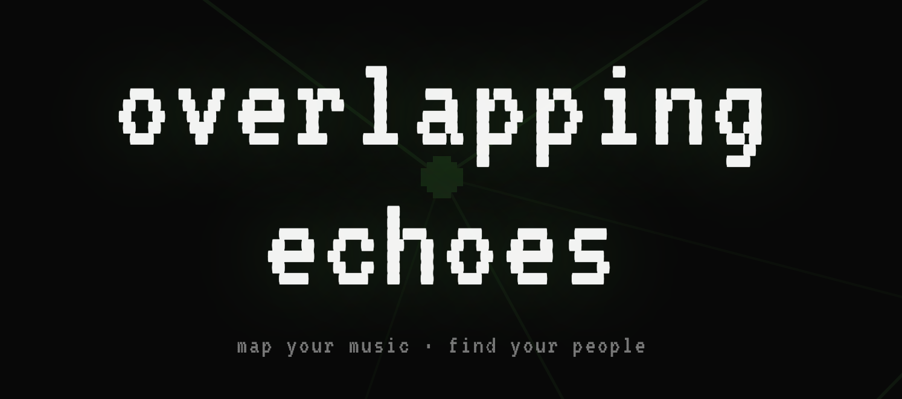

# overlapping echoes

Originally a school project for implementing shared queues in Spotify, turned into a knowledge graph visualization of music taste similarity with your friends.

You log in with Spotify, your friends log in with Spotify, and the app builds a force-directed graph where edge weights reflect how much your listening habits overlap. The closer two nodes, the more your tastes align. admittedly, some work needs to be put towards interpretability. 

**[try it here](www.overlappingechoes.com)**

## how it works

- pulls your top tracks and artists from the Spotify API
- computes similarity scores between you and your friends using genre/artist overlap and lyric-derived embeddings
- renders everything as an interactive D3 force graph — node opacity maps to taste similarity, you can drag nodes around, click to explore profiles

## stack

- **frontend**: React + TypeScript + D3, hosted on S3/CloudFront
- **backend**: Python Lambda functions behind API Gateway (AWS SAM)
- **storage**: DynamoDB for user profiles and friend graphs

## wip

the similarity mechanism is rough. the plan is to lean into listening history and recent footprints — building richer embeddings from what people actually play, not just what Spotify surfaces as their "top" content. something more continuous and less snapshot-y. 

*we are open to any contributions or suggestions, especially in regards to richer cooler embeddings or similarity computations (relying on waves, for instance), enhancing interactivity and interpretability of the app, etc.*

## authors

Rodrigo Sastré
